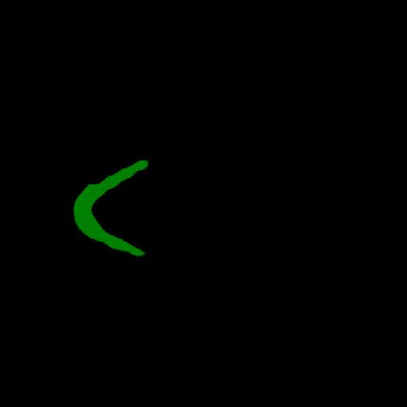

<h2>Tensorflow-Image-Segmentation-Pre-Augmented-Mandible (2025/03/31)</h2>

Sarah T. Arai 
Software Laboratory antillia.com  

This is the first experiment of Image Segmentation for Pre Augmented PDDCA Mandible 
 based on 
the latest <a href="https://github.com/sarah-antillia/Tensorflow-Image-Segmentation-API">Tensorflow-Image-Segmentation-API</a>, 
and  <a href="https://drive.google.com/file/d/1SM9T85KPoLsU5TQK6CeBbo85Afuic_Fo/view?usp=sharing">
Augmented-Mandible-ImageMask-Dataset.zip</a>, which was derived by us from 
<a href="https://www.imagenglab.com/newsite/pddca/">
<b>
PDDCA (A Public Domain Database for Computational Anatomy)
</b>
</a>
 

 
 
<b>Data Augmentation Strategy:</b> 
 To address the limited size of Mandible, 
 we employed <a href="./generator/ImageMaskDatasetGenerator.py">an offline augmentation tool</a> to create 
 the Augmented-Mandible-ImageMask-Dataset, which supports the following augmentation methods.
<li>Vertical flip</li>
<li>Horizontal flip</li>
<li>Rotation</li>
<li>Shrinks</li>
<li>Shears</li> 
<li>Deformation</li>
<li>Distortion</li>
<li>Barrel distortion</li>
<li>Pincushion distortion</li>
 
Please see also the following tools  
<li><a href="https://github.com/sarah-antillia/Image-Deformation-Tool">Image-Deformation-Tool</a></li>
<li><a href="https://github.com/sarah-antillia/Image-Distortion-Tool">Image-Distortion-Tool</a></li>
<li><a href="https://github.com/sarah-antillia/Barrel-Image-Distortion-Tool">Barrel-Image-Distortion-Tool</a></li>

 

<b>Actual Image Segmentation for Images of 512x512 pixels</b> 
As shown below, the inferred masks look similar to the ground truth masks.  

<table>
<tr>
<th>Input: image</th>
<th>Mask (ground_truth)</th>
<th>Prediction: inferred_mask</th>
</tr>
<tr>
<td></td>
<td></td>
<td></td>
</tr>

<tr>
<td></td>
<td></td>
<td></td>
</tr>

<tr>
<td></td>
<td></td>
<td></td>
</tr>
</table>

 
In this experiment, we used the simple UNet Model 
<a href="./src/TensorflowUNet.py">TensorflowSlightlyFlexibleUNet</a> for this MandibleSegmentation Model. 
As shown in <a href="https://github.com/sarah-antillia/Tensorflow-Image-Segmentation-API">Tensorflow-Image-Segmentation-API</a>.
you may try other Tensorflow UNet Models: 

<li><a href="./src/TensorflowSwinUNet.py">TensorflowSwinUNet.py</a></li>
<li><a href="./src/TensorflowMultiResUNet.py">TensorflowMultiResUNet.py</a></li>
<li><a href="./src/TensorflowAttentionUNet.py">TensorflowAttentionUNet.py</a></li>
<li><a href="./src/TensorflowEfficientUNet.py">TensorflowEfficientUNet.py</a></li>
<li><a href="./src/TensorflowUNet3Plus.py">TensorflowUNet3Plus.py</a></li>
<li><a href="./src/TensorflowDeepLabV3Plus.py">TensorflowDeepLabV3Plus.py</a></li>

 

<h3>1. Dataset Citation</h3>
The dataset used here has been derived from the following web site: 

<a href="https://www.imagenglab.com/newsite/pddca/">
<b>
PDDCA (A Public Domain Database for Computational Anatomy)
</b>
</a>
 
 
<b>version 1.4.1</b> 
 

This database is provided and maintained by Dr. Gregory C Sharp (Harvard Medical School – MGH, Boston) and his group. 

The data here provided have been used for the “Head and Neck Auto Segmentation MICCAI Challenge (2015)” .
To cite the challenge or the data, please refer to: 
Raudaschl, P. F., Zaffino, P., Sharp, G. C., Spadea, M. F., Chen, A., Dawant, B. M., … & Jung, F. (2017). 
Evaluation of segmentation methods on head and neck CT: Auto‐segmentation challenge 2015. 
Medical Physics, 44(5), 2020-2036. 
 
PDDCA version 1.4.1 comprises 48 patient CT images from the Radiation Therapy Oncology Group (RTOG) 0522 study (a multi-institutional clinical trial led by Dr Kian Ang), together with manual segmentation of left and right parotid glands, brainstem, optic chiasm, optic nerves (both left and right), mandible, submandibular glands (both left and right) and manual identification of bony landmarks.
We give this data to the community in the hopes that it will be helpful. Any errors in delineation and markup are ours, and are not the fault of participating doctors.
Please see pddca.odt for complete information. 
For practical reasons the database is split in 3 zipped files.
Part 3 contains images with some of the above listed structures missing.
 
 
<b>Citation</b> 
@article{raudaschl2017evaluation, 
  title={Evaluation of segmentation methods on head and neck CT: auto-segmentation challenge 2015}, 
  author={Raudaschl, Patrik F and Zaffino, Paolo and Sharp, Gregory C and Spadea,  
  Maria Francesca and Chen, Antong and Dawant, Benoit M and Albrecht, Thomas and Gass,  
  Tobias and Langguth, Christoph and L{\"u}thi, Marcel and others}, 
  journal={Medical physics}, 
  volume={44}, 
  number={5}, 
  pages={2020--2036}, 
  year={2017}, 
  publisher={Wiley Online Library} 
} 

 
<h3>
<a id="2">
2 Augmented Mandible ImageMask Dataset
</a>
</h3>
 If you would like to train this Mandible Segmentation model by yourself,
 please download our 512x512 pixels dataset from the google drive  
<a href="https://drive.google.com/file/d/1SM9T85KPoLsU5TQK6CeBbo85Afuic_Fo/view?usp=sharing">
Augmented-Mandible-ImageMask-Dataset.zip</a>
, expand the downloaded ImageMaskDataset and put it under <b>./dataset</b> folder to be
<pre>
./dataset
└─Augmented-Mandible
    ├─test
    │   ├─images
    │   └─masks
    ├─train
    │   ├─images
    │   └─masks
    └─valid
        ├─images
        └─masks
</pre>
 
On the derivation of this dataset, please refer to the following Python scripts: 
<li><a href="./generator/HaNImageMaskDatasetGenerator.py">HaNImageMaskDatasetGenerator.py</a></li>
<li><a href="./generator/ImageMaskDatasetGenerator.py">ImageMaskDatasetGenerator.py</a></li>
<li><a href="./generator/split_augmented_master.py">split_augmented_master.py.</a></li>
 
 
<b>Augmented-Mandible Statistics</b> 
 
 
As shown above, the number of images of train and valid datasets is enough to use for a training set of our segmentation model.
 
 
<b>Train_images_sample</b> 

 
<b>Train_masks_sample</b> 

 

<h3>
3 Train TensorflowUNet Model
</h3>
 We trained Augmented-Mandible TensorflowUNet Model by using the following
<a href="./projects/TensorflowSlightlyFlexibleUNet/Augmented-Mandible/train_eval_infer.config"> <b>train_eval_infer.config</b></a> file.  
Please move to ./projects/TensorflowSlightlyFlexibleUNet/Augmented-Mandibleand run the following bat file. 
<pre>
>1.train.bat
</pre>
, which simply runs the following command. 
<pre>
>python ../../../src/TensorflowUNetTrainer.py ./train_eval_infer.config
</pre>

<b>Model parameters</b> 
Defined a small <b>base_filters</b> and large <b>base_kernels</b> for the first Conv Layer of Encoder Block of 
<a href="./src/TensorflowUNet.py">TensorflowUNet.py</a> 
and a large num_layers (including a bridge between Encoder and Decoder Blocks).
<pre>
[model]
base_filters   = 16
base_kernels   = (9,9)
num_layers     = 8
dilation       = (3,3)
</pre>

<b>Learning rate</b> 
Defined a small learning rate.  
<pre>
[model]
learning_rate  = 0.0001
</pre>

<b>Loss and metrics functions</b> 
Specified "bce_dice_loss" and "dice_coef". 
<pre>
[model]
loss           = "bce_dice_loss"
metrics        = ["dice_coef"]
</pre>
<b >Learning rate reducer callback</b> 
Enabled learing_rate_reducer callback, and a small reducer_patience.
<pre> 
[train]
learning_rate_reducer = True
reducer_factor     = 0.4
reducer_patience   = 4
</pre>

<b>Early stopping callback</b> 
Enabled early stopping callback with patience parameter.
<pre>
[train]
patience      = 10
</pre>

<b>Epoch change inference callbacks</b> 
Enabled epoch_change_infer callback. 
<pre>
[train]
epoch_change_infer       = True
epoch_change_infer_dir   =  "./epoch_change_infer"
epoch_changeinfer        = False
epoch_changeinfer_dir    = "./epoch_changeinfer"
num_infer_images         = 6
</pre>

By using this epoch_change_infer callback, on every epoch_change, the inference procedure can be called
 for 6 images in <b>mini_test</b> folder. This will help you confirm how the predicted mask changes 
 at each epoch during your training process.    

<b>Epoch_change_inference output at starting (1,2,3)</b> 
 
 
<b>Epoch_change_inference output at ending (98,99,100)</b> 
 
 

In this experiment, the training process was terminated at epoch 100.  
 
 

<a href="./projects/TensorflowSlightlyFlexibleUNet/Augmented-Mandible/eval/train_metrics.csv">train_metrics.csv</a> 
 

 
<a href="./projects/TensorflowSlightlyFlexibleUNet/Augmented-Mandible/eval/train_losses.csv">train_losses.csv</a> 
 
 

<h3>
4 Evaluation
</h3>
Please move to a <b>./projects/TensorflowSlightlyFlexibleUNet/Augmented-Mandible</b> folder, 
and run the following bat file to evaluate TensorflowUNet model for Augmented-Mandible. 
<pre>
./2.evaluate.bat
</pre>
This bat file simply runs the following command.
<pre>
python ../../../src/TensorflowUNetEvaluator.py ./train_eval_infer_aug.config
</pre>

Evaluation console output: 

  Image-Segmentation-Augmented-Mandible

<a href="./projects/TensorflowSlightlyFlexibleUNet/Augmented-Mandible/evaluation.csv">evaluation.csv</a> 

The loss (bce_dice_loss) to this Augmented-Mandible/test was not low, but dice_coef not high as shown below.
 
<pre>
loss,0.211
dice_coef,0.5964
</pre>
 

<h3>
5 Inference
</h3>
Please move to a <b>./projects/TensorflowSlightlyFlexibleUNet/Augmented-Mandible</b> folder 
, and run the following bat file to infer segmentation regions for images by the Trained-TensorflowUNet model for Augmented-Mandible. 
<pre>
./3.infer.bat
</pre>
This simply runs the following command.
<pre>
python ../../../src/TensorflowUNetInferencer.py ./train_eval_infer_aug.config
</pre>

<b>mini_test_images</b> 
 
<b>mini_test_mask(ground_truth)</b> 
 

<b>Inferred test masks</b> 
 
 

<b>Enlarged images and masks </b> 

<table>
<tr>
<th>Image</th>
<th>Mask (ground_truth)</th>
<th>Inferred-mask</th>
</tr>

<tr>
<td></td>
<td></td>
<td></td>
</tr>

<tr>
<td></td>
<td></td>
<td></td>
</tr>

<tr>
<td></td>
<td></td>
<td></td>
</tr>
<tr>
<td></td>
<td></td>
<td></td>
</tr>
<tr>
<td></td>
<td></td>
<td></td>
</tr>
<tr>
<td></td>
<td></td>
<td></td>
</tr>
</table>

 

<h3>
References
</h3>
<b>1. PDDCA</b> 
<a href="https://github.com/openmedlab/Awesome-Medical-Dataset/blob/main/resources/PDDCA.md">
Awesome-Medical-Dataset/resources/PDDCA.md</a>
 

 
<b>2. Organ at Risk Segmentation in Head and Neck CT Images Using a Two-Stage Segmentation  
Framework Based on 3D U-Net</b>
 
Yueyue Wang, Liang Zhao, Manning Wang, and Zhijian Song 
<a href="https://arxiv.org/pdf/1809.00960v2">https://arxiv.org/pdf/1809.00960v2</a>
 
 
<b>3. Automatic Segmentation of Mandible from Conventional Methods to Deep Learning—A Review</b> 
Bingjiang Qiu, Hylke van der Wel, Joep Kraeima, Haye Hendrik Glas, Jiapan Guo, Ronald J H Borra,  
Max Johannes Hendrikus Witjes, Peter M A van Ooijen 

<a href="https://pmc.ncbi.nlm.nih.gov/articles/PMC8307673/">https://pmc.ncbi.nlm.nih.gov/articles/PMC8307673/</a>
 
 

<b>3. Mandible segmentation from CT data for virtual surgical planning using an augmented  
two-stepped convolutional neural network</b> 
Tobias Pankert, Hyun Lee 1, Florian Peters, Frank Hölzle, Ali Modabber, Stefan Raith 
<a href="https://pmc.ncbi.nlm.nih.gov/articles/PMC10363055/">https://pmc.ncbi.nlm.nih.gov/articles/PMC10363055/</a>
 
 
